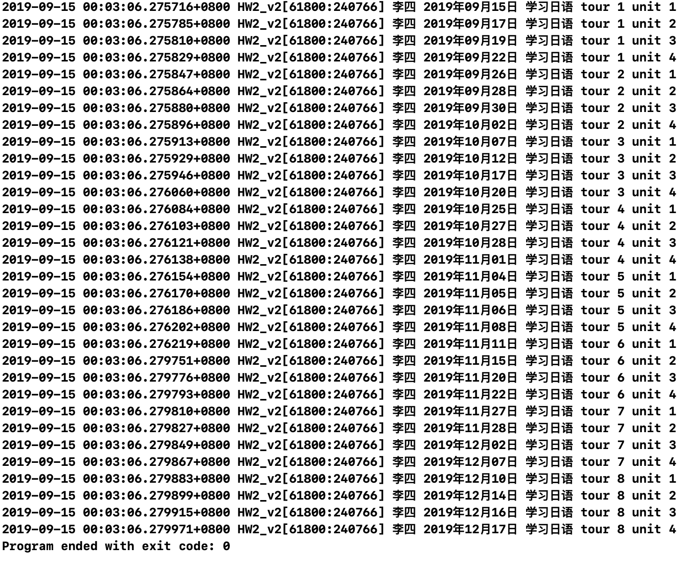

#MOSAD_HW2实验报告

尹豪 15331378

## 实验目的

1. 学习掌握Objective-C语法，掌握基础字符串操作。
2. OO知识——多态与继承。

## 开发环境

- Mac OS 10.14
- Objective-C
- Xcode 10.1

## 实验内容

给定三个用户张三，李四，王五。

给定四种语言英语、日语、德语、西班牙语。

实现场景输出（log形式即可）：随机选择一个用户和一种语言学习，从**当前日期**开始，随机产生时间进行学习，输出学习进度直至学习完毕。每个语言共8个tour，每个tour共4个unit，每次学习一个unit。

要求：

- 随机选定人名、语言后，一次性输出所有的结果。
- 随机时间指的是每次随机1-5天，每次学习时间在前一次的基础上加上刚刚随机出的天数。
- 需要用到多态。

输出例子： 张三 某年某月某日 学习日语 tour 1 unit 1。


## 项目结构

```txt
.
├── HWLanguage.h
├── HWLanguage.m
└── main.m
```

#### HWLanguage类

拥有`process_tour`和`process_unit`的成员变量。

```objective-c
//重写init方法，将tour和unit初始值设定为1
- (instancetype)init;
//此方法每调用一次，会修改unit和tour到下一个unit对应的值
- (void)learnOneUnit;
//返回当前对象的tour值
- (NSInteger)getTour;
//返回当前对象的unit值
- (NSInteger)getUnit;
//通过tour判断学习是否结束
- (bool)isFinish;
//获取当前学习的语言名字
- (NSString *)getName;
```


#### HWPersonWhoLearnXXX类

这四个类继承自`HWLanguage`类，各自重写了父类的`learnOneUnit`方法，被调用后可以修改对应的学习进度。

#### main.m

main的主要任务是，存入姓名集后，随机实例化上述某个子类，并从姓名集中随机挑出一个姓名，使用这个名字进行输出。

随后，获取当前时间的`NSDate`变量命名为`learnDate`，在循环中使用`NSLog`输出作业要求的语句，并重复调用前述对象的`learnOneUnit`方法，每次调用后，在`learnDate`的基础上，随机增加1～5天并赋值给`learnDate`，直至`isFinished`返回`true`，循环结束。

## 具体代码

遇到以下几个具体问题，详细说明代码的思路。

#### 问题1:获取当前时间的NSDate

```objective-c
//获取当前时间，作为开始学习的时间
NSDate *learnDate = [NSDate date];
```

向`NSDate`类发送`date`消息，会返回当前时间的`NSDate`实例。

#### 问题2:从四个类中随机实例化

首先，使用`arc4random()`函数获取随机数，代表对应的类。但在实例化对应的类时出了问题，代码如下：

```objective-c
//第一版错误代码
int indexOfLanguage = arc4random() % 4;
switch (indexOfLanguage) {
  case 0:{
    English* lang = [[English alloc] init];
    break;
  }
  case 1:{
    Japanese* lang = [[Japanese alloc] init];
    break;
  }
  case 2:{
    German* lang = [[German alloc] init];
  }
  case 3:{
    Spanish* lang = [[Spanish alloc] init];
  }
  default:
    break;
}
```

显然，像上面这样实例化的话，lang是无法在switch代码块以外使用的，但我们又不能在switch外直接声明对应的对象。这时我们就需要用到多态了，在switch前用父类`HWLanguage`声明一个对象。

```objective-c
//正确代码
//用随机数确定名字和学习的语言
int indexOfLanguage = arc4random() % 4;
//用HWLanguage类型声明一个对象
HWLanguage* lang;
//学习什么语言，就实例化对应的类
switch (indexOfLanguage) {
  case 0:{
    lang = [[English alloc] init];
    break;
  }
  case 1:{
    lang = [[Japanese alloc] init];
    break;
  }
  case 2:{
    lang = [[German alloc] init];
  }
  case 3:{
    lang = [[Spanish alloc] init];
  }
  default:
    break;
}
```

#### 问题3:随机选择姓名

首先使用`NSArray`储存姓名，然后使用随机数挑选其中的一个姓名。具体代码如下：

```objective-c
//名字集
NSArray *names = @[@"张三",@"李四",@"王五"];
//用随机数确定名字和学习的语言
int indexOfNames = arc4random() % 3;
//使用names[indexOfNames]表示随机结果
```

#### 问题4:按天更新learnDate变量

这里用到`NSDateComponent`类和`NSCalendar`类来辅助更新`learnDate`。具体是需要用到`dateByAddingComponenets`方法。代码如下

```objective-c
//更新下次学习的时间，修改的值随机生成[1,5]的整数
int daysToNextLearn = (arc4random() % 5) + 1;
NSDateComponents *dayComponent = [[NSDateComponents alloc] init];
dayComponent.day = daysToNextLearn;
//使用NSCalendar和dayComponent修改learnDate
NSCalendar *theCalendar = [NSCalendar currentCalendar];
learnDate = [theCalendar dateByAddingComponents:dayComponent toDate:learnDate options:0];
```

#### 问题5:从learnDate中获取对应的年月日

这里同样需要用到`NSCalendar`类的`getEra`方法。

`- (void)getEra:(out NSInteger *)eraValuePointer year:(out NSInteger *)yearValuePointer month:(out NSInteger *)monthValuePointer day:(out NSInteger *)dayValuePointer fromDate:(NSDate *)date;`

调用后，会将`date`的年月日存入至传入的整数类型指针中。具体代码如下：

```objective-c
//NSCalendar一定要用currentCalendar初始化
NSCalendar *cal = [NSCalendar currentCalendar];
//转化后的年月日
NSInteger year;
NSInteger month;
NSInteger day;
//从learnDate中，获取对应的年月日并存到对应变量中
[cal getEra:nil year:&year month:&month day:&day fromDate:learnDate];
```

但仍有一点需要注意：样例输出中，月和日都是两位的，但`NSInteger`有可能只有一位。这个小问题的解决办法有很多，我的方法是在输出前判断日和月的值，如果小于10则输出时在数据前补上一个0。具体代码如下

```objective-c
//按格式输出
//当月或日为一位数时，需要补0
NSString *monthPlaceHolder = @"";
NSString *dayPlaceHolder = @"";
if(month < 10){
  monthPlaceHolder = @"0";
}
if(day < 10){
  dayPlaceHolder = @"0";
}
NSLog(@"%@ %ld年%@%ld月%@%ld日 学习日语 tour %ld unit %ld",self.name,(long)year,monthPlaceHolder,(long)month,dayPlaceHolder,(long)day,(long)tour,(long)unit);
```

#### 问题6:设定tour和unit的初始值为1

如果我们希望对象创建出来以后,对象的属性的值不是默认值0/nil/NULL,而是我们期望的值,那么我们就可以重写init方法.

```txt
    1, 先调用父类的init方法.

    2, init方法有返回值,返回值是当前对象,调用init方法有可能会执行失败,执行失败返回值就是nil.调用父类的init方法,将这个方法的返回值赋值给self.

    3, 判断父类的init方法是否执行成功,如果成功,再去按照自己期望的方式初始化自己的属性.

    4, 返回当前对象,self.
```
具体代码如下

```objective-c
//重写init方法，将tour和unit初始值设定为1
- (instancetype)init{
    if(self = [super init]){//说明父类init方法调用成功
        //将tour和unit的初始值设定为1
        self->progress_tour = 1;
        self->progress_unit = 1;
    }
    return self;
}
```


## 运行结果

满足作业要求，截图如下



## 总结

- **什么是多态：**不同的对象以自己的方式响应相同名称方法的能力称为多态（父类指针指向子类对象）
- 多态的条件：
  - 有继承关系、有方法重写
  - 父类的声明变量指向子类对象
- 多态的优点：
  - 多态的主要好处就是**简化了编程接口**。它准许**在类和类之间重用一些习惯性的命名**，而不用为每一个新加的函数命名一个新的名字。这样，编程接口就是一些抽象的行为的集合，从而和实现接口的类的区分开来。
  - 多态也使得代码可以分散在不同的对象中而不用**试图在一个函数中考虑到所有可能的对象**。这样使得你的代码扩展性和复用性更好一些。当一个新的情景出现时，你无须对现有的代码进行改动，而只需要增加一个新的类和新的同名方法。