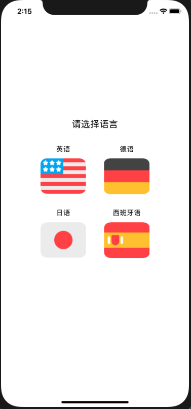

# 中山大学数据科学与计算机学院本科生实验报告
| 课程名称 | 现代操作系统应用开发 |   任课老师   |      郑贵锋       |
| :------: | :------------------: | :----------: | :---------------: |
|   年级   |         15级         | 专业（方向） |      嵌入式       |
|   学号   |       15331378       |     姓名     |       尹豪        |
|   电话   |     13307461421      |    Email     | 1103912716@qq.com |
| 开始日期 |      2019.9.20       |   完成日期   |     2019.9.27     |


## 一、实验题目

个人作业3 - UI组件布局学习


## 二、实现内容

实现一个包含若干页面和子页面的"多语言学习App"，页面如下：

|            初始页面            |          语言学习页面          |
| :----------------------------: | :----------------------------: |
|       |       |
| 个人档案页面（用户信息子页面） | 个人档案页面（用户设置子页面） |
|       |       |


## 三、实验结果

### (1)实验截图


### (2)实验步骤以及关键代码

整个项目的结构如下

```txt
.
├── AppDelegate.h
├── AppDelegate.m
├── Asserts																//资源文件
│   └── Images.xcassets
│       ├── English.png
│       ├── German.png
│       ├── Japanese.png
│       ├── Spanish.png
│       ├── learn1.png
│       ├── learn2.png
│       ├── user1.png
│       └── user2.png
├── Assets.xcassets//xcode项目配置文件
│   ├── AppIcon.appiconset
│   │   └── Contents.json
│   └── Contents.json
├── Base.lproj
├── Controllers														//三个主要的ViewController
│   ├── LearningTableViewController.h			//学习页面，主体为一个tableView
│   ├── LearningTableViewController.m
│   ├── SelectLanguageViewController.h		//首页，有四种语言可供选择
│   ├── SelectLanguageViewController.m
│   ├── UserViewController.h//用户页面
│   └── UserViewController.m
├── Info.plist
├── ViewController.h
├── ViewController.m
├── Views																	//主页面布局
│   ├── SelectLanguageCollectionViewCell.h
│   ├── SelectLanguageCollectionViewCell.m
│   ├── SelectLanguageView.h
│   └── SelectLanguageView.m
└── main.m

```

整个app的`rootViewController`为一个`navigationController`，通过它进行各个页面之间的跳转。在此基础上，进行三个页面的代码布局及逻辑处理。首先完成选择语言的页面，这个页面的布局文件主要放在Views文件夹中，但实际上由于`CollectionView` 的特殊，在`selectLanguageViewController`文件中也有对其布局的相关处理。完成布局后，监听cells的点击事件，然后跳转到tarBar控制器，显示学习页面。

剩余工作就是其余页面的布局编写，以及tarBar内部的跳转逻辑。有一些细节需要额外处理，已经写在下面。

### (3)实验遇到的困难以及解决思路

#### 问题1:tabBar上的图标没有颜色

修改`UIImage`图片的渲染模式即可。

```objective-c
UIImage *img = [[UIImage imageNamed:@"user2" ] imageWithRenderingMode:UIImageRenderingModeAlwaysOriginal];
```

#### 问题2:首页隐藏nav

需要注意的是向`navigationController`发送`setNavigationBarHidden:`方法的时机，同下一个问题一样，由于`viewDidLoad()`只会调用一次，因此如果需要一切换回主屏幕就隐藏导航栏的话，需要在`viewWillAppear()`中修改导航栏的隐藏性。

```objective-c
- (void)viewWillAppear:(BOOL)animated {
    [super viewWillAppear:animated];
    //隐藏nav
    [self.navigationController setNavigationBarHidden:YES animated:animated];
}

- (void)viewWillDisappear:(BOOL)animated {
    [super viewWillDisappear:animated];
    //跳转其他页面，取消navBar隐藏
    [self.navigationController setNavigationBarHidden:NO animated:animated];
}
```

#### 问题3:点击tabBar，切换页面标题

tabBar会自行切换对应页面的Controller，我们则需要在切换后页面Controller中的`viewWillAppear()`方法中修改`navigationItem`的标题（具体方法如下），否则是无法 正常显示的，因为两个页面来回切换时并不会调用`viewDidLoad()`方法。

```objective-c
- (void)viewWillAppear:(BOOL)animated{
    [super viewWillAppear:animated];
    //设置navTitle
    [self.parentViewController.navigationItem setTitle:@"个人档案"];
}
```

#### 问题4:用户页的pageView滑动切换时，同步修改segmentControl控件的显示

这个问题需要在pageView的相应钩子函数中进行处理，看完文档后我认为下面代码中的方法是最合适的，然而这个方法的参数并不会提供翻页结束后页面的Controller，也就是只能通过翻页前的Controller判断翻页结束后所显示的页面。由于本次实验的pageView只有两个页面，因此影响不大，但假如页面更多的话就无法通过`previousViewControllers`来判断了，因此只能适用于仅有两个页面的情况。

```objective-c
//翻页成功后调用
//设置segmentedControl的显示
- (void)pageViewController:(UIPageViewController *)pageViewController
didFinishAnimating:(BOOL)finished 
  previousViewControllers:(nonnull NSArray<UIViewController *> *)previousViewControllers transitionCompleted:(BOOL)completed
{
    //暂时没想到更加合理的实现，这种实现方式只能用于两个标签页的时候。
    if(completed){
        NSInteger index = [self indexOfViewInArray:previousViewControllers[0]];
        _segmentC.selectedSegmentIndex = (index + 1) % 2;
    }
}
```


## 四、实验思考及感想

- 官方文档非常有用，在某个控件或其方法不熟悉时，可以直接在xcode上查阅其用法。
- 本次实验的布局完全由原生纯代码完成，从下次实验开始使用老师介绍的开源布局工具（Masonry）。

