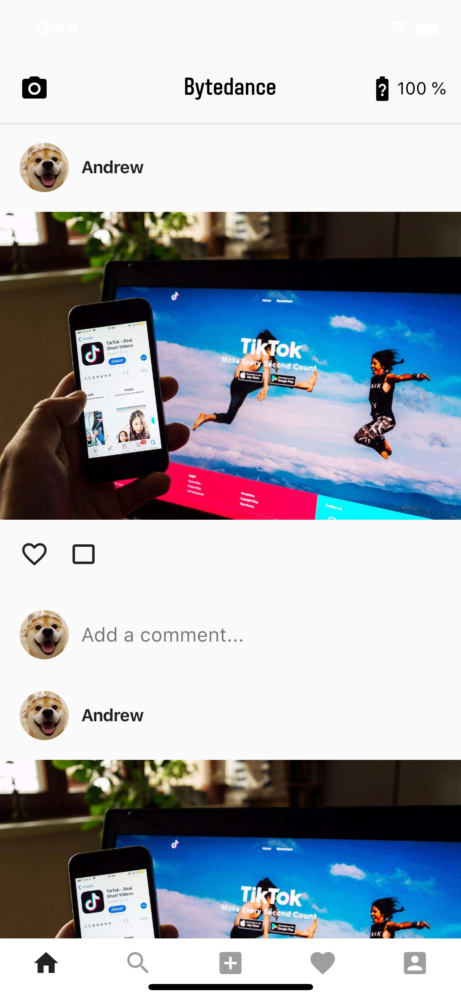
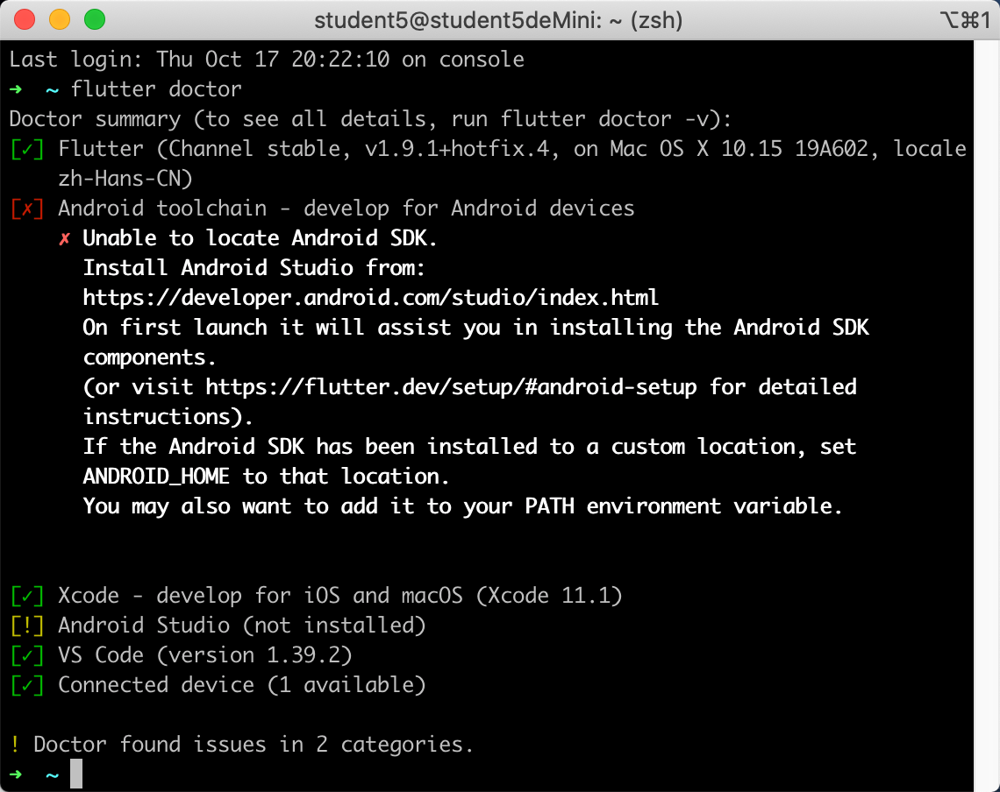

# 中山大学数据科学与计算机学院本科生实验报告
| 课程名称 | 现代操作系统应用开发 |   任课老师   |       郑贵锋       |
| :------: | :------------------: | :----------: | :----------------: |
|   年级   |         15级         | 专业（方向） | 软件工程（嵌入式） |
|   学号   |       15331378       |     姓名     |        尹豪        |
|   电话   |     13307461421      |     邮箱     | 1103912716@qq.com  |
| 开始日期 |      2019.10.12      |   完成日期   |     2019.10.17     |

- [ 中山大学数据科学与计算机学院本科生实验报告](#1-中山大学数据科学与计算机学院本科生实验报告)
    - [ 1. 一、实验题目](#11-一实验题目)
    - [ 2. 二、实现内容](#12-二实现内容)
    - [ 3. 三、实验结果](#13-三实验结果)
        - [ 3.1. (1)实验截图](#131-1实验截图)
        - [ 3.2. (2)实验步骤以及关键代码](#132-2实验步骤以及关键代码)
            - [ 3.2.1. 一、安装flutter环境](#1321-一安装flutter环境)
            - [ 3.2.2. 二、创建一个flutter项目](#1322-二创建一个flutter项目)
            - [ 3.2.3. 三、完成页面布局](#1323-三完成页面布局)
            - [ 3.2.4. 四、完成交互](#1324-四完成交互)
        - [ 3.3. (3)实验遇到的困难以及解决思路](#133-3实验遇到的困难以及解决思路)
            - [ 3.3.1. 一、指定iOS端使用的语言](#1331-一指定ios端使用的语言)
            - [ 3.3.2. 二、调整全面屏的底栏padding](#1332-二调整全面屏的底栏padding)
    - [ 4. 四、实验思考及感想](#14-四实验思考及感想)

<a name="11-一实验题目"></a>
##  一、实验题目

个人作业4 - Flutter UI组件布局学习


<a name="12-二实现内容"></a>
## 2. 二、实现内容

首先参考官方教程搭建Flutter开发环境：https://flutterchina.club/setup-macos/

使用Flutter实现一个包含一个feed流页面的"社交App"，主页面如下：




<a name="13-三实验结果"></a>
## 3. 三、实验结果
<a name="131-1实验截图"></a>
### 3.1. (1)实验截图


<a name="132-2实验步骤以及关键代码"></a>
### 3.2. (2)实验步骤以及关键代码
<a name="1321-一安装flutter环境"></a>
#### 3.2.1. 一、安装flutter环境

首先是安装flutter环境，参照https://flutterchina.club/setup-macos/ 可以很容易在macOS上装好。由于实验只要求在iOS或android平台的其中一个上实现，因此我没有使用Android Studio，而是直接用VSCode来完成这次实验。

在安装过程中，可以在命令行用`flutter doctor`来查看安装情况，根据提示找到安装上的问题。下图是我安装后的结果，前面已经说明了没有使用Android Studio的原因。可以看到Xode和VS Code前面的绿色对勾，说明Xcode和VSCode的flutter支持已经安装好，我们已经可以使用VSCode编写flutter代码，并编译成iOS应用，而且可以在Xcode自带的iOS模拟器上调试。




<a name="1322-二创建一个flutter项目"></a>
#### 3.2.2. 二、创建一个flutter项目

可以使用VSCode的flutter拓展，在GUI下创建，也可以直接在终端中使用`flutter -i objc create hw4`命令创建，这条命令会在当前目录下创建一个名为`hw4`的flutter项目，其中`-i objc`的参数会在iOS部分使用`Objective C`，否则会默认使用`swift`，这会影响我们用原生代码获取设备电量。

flutter项目创建成功后，我们就可以在此基础上完成本次实验。
<a name="1323-三完成页面布局"></a>
#### 3.2.3. 三、完成页面布局

实验要求中，主要页面布局可以分为三个部分

- 顶部的AppBar，包括左侧的相机图标，中间的标题，右侧的电池图标

- 中间的LIstView，由六个相同的cell构成

- 底部的BottomAppBar，其上有五个图标

我们可以按照这三个部分分别去完成。

其中，AppBar和BottomAppBar是集成于`scaffold`的，而ListView位于这个`scanffold`的`body`位置。

```dart
//主界面的listview及其状态类
class FeedFlowListView extends StatefulWidget{
  @override
  createState() => new FeedFlowListViewState();
}

class FeedFlowListViewState extends State<FeedFlowListView>{
  @override
  Widget build(BuildContext context){
    return ListView.builder(
      //padding: const EdgeInsets.all(8),
      itemCount: 6,
      itemBuilder: (BuildContext context, int index) {  
        return _createPostView();
      }
    );
  }

  //下面的函数返回一个cell的container，具体内容此处省略
  Container _createPostView(){...}
}
```
<a name="1324-四完成交互"></a>
#### 3.2.4. 四、完成交互

交互分为两个点

- 点击ListView中的图片，跳转到图片详情页面

- 点击AppBar上的电池图标，更新电量显示

flutter的特殊之处在于，它的大部分原生控件是不响应点击事件的，我们需要用一个具有点击事件的控件作为它的父控件，例如 `GestureDetector`, `InkResponse`, `InkWell`等。

```dart
...//在主页scaffold的body里
InkWell(
	child: Image(
  	image: AssetImage('assets/imgs/timg.jpeg'),
	),
	onTap: _pushDetail,
),
...
 
//跳转函数 跳转到图片详情页面
  //因为需要用到当前页面的context 所以这个函数写在主页widget的state类下
  void _pushDetail(){
    Navigator.of(context).push(
      new MaterialPageRoute(
        builder: (context) {
          return Scaffold(
            appBar: AppBar(
              title: Text('Andrew'),
               textTheme: TextTheme(
                title: TextStyle(
                  fontFamily: 'Archyedt',
                  color: Colors.black,
                  fontSize: 25,
                ),
               ),
            ),
            body:Center(
              child:Image(image: AssetImage('assets/imgs/timg.jpeg'),)
            ), 
          );
        }
      )
    );
  }
```

其中，获取电池电量的功能，还需要`MethodChannel`与原生代码配合实现

参考flutter官方文档https://flutterchina.club/platform-channels/

```dart
//处理电池图标点击事件
  void _battaryIconOnTap() async {
    int battery = await _getBatteryLevel();
    setState(() {
      _battaryLevel = battery;
    });
  }

  //通过Channel获取电量信息
  Future<int> _getBatteryLevel() async {
    try {
      final int result = await batteryMethonChannel.invokeMethod('getBatteryLevel');
      return result;
    }on PlatformException catch (e) {
      log('Faild to get battery level: "${e.message}"');
      return -1;
    }
  }
```

至此，实验完成了。
<a name="133-3实验遇到的困难以及解决思路"></a>
### 3.3. (3)实验遇到的困难以及解决思路
<a name="1331-一指定iOS端使用的语言"></a>
#### 3.3.1. 一、指定iOS端使用的语言

在一开始直接用`flutter create hw4`创建了项目，写到最后才发现iOS端是默认使用`swift`的，猜测可能跟xcode的默认语言有关所以官方没有特别指出。

只需要在创建时命令中加入参数即可。使用`flutter -i objc create hw4`。
<a name="1332-二调整全面屏的底栏padding"></a>
#### 3.3.2. 二、调整全面屏的底栏padding

实验要求的截图中，padding要比默认情况小。经过研究之后发现，在`https://github.com/flutter/flutter/pull/13442`这次merged中，flutter已经自动为全面屏设置了padding，通过`MediaQuery.of(context).padding`可以获取到其默认值为`EdgeInsets(0.0, 44.0, 0.0, 34.0)`，可以看到`bottom`值为34.0。

如果我们一定要修改下边距，则只能自己实现状态管理，由于其过于复杂且34是官方推荐的safe Area高度，故不对其进行处理。至于为什么实验要求可以做到这么窄？猜测可能使用的是老版本的flutter，没有更新全面屏的底栏padding。
<a name="14-四实验思考及感想"></a>
## 4. 四、实验思考及感想

使用类似于flutter这样的跨平台开发工具可以极大的简化开发者的工作。在团队较小，应用对性能要求不高时，使用flutter可以快速开发初始版本。但flutter这种第三方工具，可能无法实现原生控件的一些用法，另外性能可能也不如原生代码（尽管如此，flutter的性能还是十分优秀的）。

