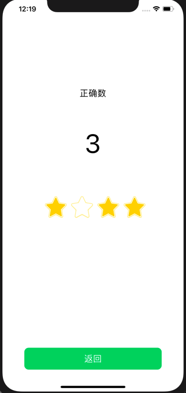

# 中山大学数据科学与计算机学院本科生实验报告
| 课程名称 | 现代操作系统应用开发 |   任课老师   |       郑贵锋       |
| :------: | :------------------: | :----------: | :----------------: |
|   年级   |         15级         | 专业（方向） | 软件工程（嵌入式） |
|   学号   |       15331378       |     姓名     |        尹豪        |
|   电话   |     13307461421      |    Email     | 1103912716@qq.com  |
| 开始日期 |      2019.10.24      |   完成日期   |     2019.10.26     |


## 一、实验题目

个人作业5 - 网络访问与动画


## 二、实现内容

实现一个简单的单词学习应用，页面如下：

|        初始页面        |       选择题页面       |
| :--------------------: | :--------------------: |
|  |  |
|        选择正确        |        选择错误        |
|  |  |
|        分数页面        |                        |
|  |                        |


## 三、实验结果

### (1)实验截图


### (2)实验步骤以及关键代码

整个app由一个`UINavigationController`控制，需要注意的是`iOS 13`多了一个叫`WindowScene`的概念，APP启动的相关操作不再在`appDelegate`中完成。

#### 1.完成选择Unit页面

这部分可以参考之前的hw3，基本结构是一致的，只需要处理几个CellView的渐变色背景即可。

本次实验没有再将View和Controller分开，因为APP规模较小，没有必要采用mvc的架构，所以是一个Controller类管理整个页面。包括UI和各种事件逻辑。

本页面的代码由两个文件构成：

- MainpageViewController.h

- MainpageViewController.m

其中主要内容是UI相关以及处理中间`CollectionView`的`DataSource`和`Delegate`。
#### 2.完成答题页面

这是整个APP的核心部分，需要处理的内容比较多。

本页面的代码由两个文件构成：

- QuizViewController.h
- QuizViewController.m

首先需要重写其初始化方法，以传入当前选择的unit，具体代码如下：

```objc
//QuizViewController.m
//初始化本页面需要调用以下方法，以便传入参数
- (instancetype) initWithUnit:(NSInteger)i{
    if(self = [super init]){
        _unitx = i;
        [self setupUI];
    }
    return self;
}
```

然后完成本页面的UI，并给各控件绑定相应的监听事件。

在本页UI初始化完成时，我们需要调用API更新控件上显示的内容。具体的执行时机应该在`ViewDidLoad`方法中，此时控件均已经初始化完成，可以修改其内容了。而网络请求，我选择使用`AFNetworking`类来实现，获取到问题后就可以更新页面上的内容了。

除了页面初始化后需要更新UI，每次回答完问题后也需要更新问题的文本。这里我们只需要监听底部的按钮，当文本是“继续”并且当前问题的序号不为3（合法的问题序号是0～3，3代表最后一个问题，此时应该跳转页面到得分页）时，我们就调用更新问题的方法即可。

剩下的内容，就是处理点击底部按钮“确认”，检验答案是否正确。我们在页面中间四个选项按钮被点击时，更新一个全局的`selectedIndex`表示当前选择的答案，这样依据这个就可以知道当前用户选择的选项。然后根据返回的结果，设置答案显示View的颜色和文本，并实现其动画效果即可。

#### 3.完成得分页面

这个页面结构相对简单，需要注意的只是中间内容的动画。

### (3)实验遇到的困难以及解决思路

####  1.渐变色和圆角

主页面的渐变色和圆角实现如下

```objc
//给cell添加背景色
        //初始化CAGradientlayer对象，使它的大小为UIView的大小
        _gradientLayer = [CAGradientLayer layer];
        _gradientLayer.frame = self.bounds;
        //将CAGradientlayer对象添加在我们要设置背景色的视图的layer层
        [self.contentView.layer addSublayer:self.gradientLayer];
        //设置渐变区域的起始和终止位置（范围为0-1）
        self.gradientLayer.startPoint = CGPointMake(-1, 0);
        self.gradientLayer.endPoint = CGPointMake(0.8, 1);
        //设置颜色数组
        self.gradientLayer.colors = @[(__bridge id)[UIColor systemPinkColor].CGColor,
                                      (__bridge id)[UIColor systemYellowColor].CGColor];
        //设置颜色分割点（范围：0-1）
        self.gradientLayer.locations = @[@(0.5f), @(1.0f)];
        
        self.contentView.layer.cornerRadius = 10;
```

#### 2.AFNetworking引入与使用

`AFNetworking`的引入需要`cocoapods`环境，这一步可以参考[cocoapods 安装第三方之--AFNetworking](https://www.jianshu.com/p/8d12127ea02a)

使用可参考 [iOS-网络编程(三)AFNetworking使用]( https://www.jianshu.com/p/d94cb6b58573 )

```objc
//下例用于获取问题，存到_questionData中
- (void)doGetQuestions
{
    //创建请求地址
    NSString *url=@"https://service-p12xr1jd-1257177282.ap-beijing.apigateway.myqcloud.com/release/HW5_api";
    //设置参数
    NSDictionary *parameters=@{@"unit":[NSString stringWithFormat:@"%ld",(long)_unitx],};
    //AFN管理者调用get请求方法
    [[self shareAFNManager] GET:url parameters:parameters progress:^(NSProgress * _Nonnull downloadProgress) {
        //返回请求返回进度
        NSLog(@"downloadProgress-->%@",downloadProgress);
    } success:^(NSURLSessionDataTask * _Nonnull task, id _Nullable responseObject) {
        //请求成功返回数据 根据responseSerializer 返回不同的数据格式
        NSLog(@"responseObject-->%@",responseObject);
        self->_questionData = responseObject[@"data"];
        [self setupLayoutWithQuestion];
        //       NSLog(@"data length is %ld, and the content is --> %@", data.count, data[1][@"question"]);
    } failure:^(NSURLSessionDataTask * _Nullable task, NSError * _Nonnull error) {
        //请求失败
        NSLog(@"error-->%@",error);
    }];
}
```

#### 3.确认按钮的不同功能的实现

确认按钮有三个功能如下

1. 文本是“确认”时，提交当前选项，获取答案的结果并设置答案相关的UI
2. 文本是“继续”时，有如下两种情况
   - 如果当前问题不是最后一个，则更新UI显示下一个问题
   - 如果当前问题已是最后一个，则跳转到分数显示的页面
具体代码实现如下，只需根据文本和此前设置的`_questionx`判断即可：
``` objc
- (void) confirm:(UIButton *)btn{
    if(_bottomBtnClickable){
        if([btn.titleLabel.text isEqualToString:@"确认"]){
            //调用检查答案的方法
            [self checkAnswer];
        }else if([btn.titleLabel.text isEqualToString:@"继续"]){
            if(_questionx != 3){
                //跳转下一题
                //相关变量初始化
                [_btns[_selectedIndex].layer setBorderWidth:0];
                [_btns[_selectedIndex] setTitleColor:[UIColor blackColor] forState:UIControlStateNormal];
                _selectedIndex = -1;
                [_bottomBtn setTitle:@"确认" forState:UIControlStateNormal];
                _bottomBtnClickable = false;
                _bottomBtn.backgroundColor = [UIColor systemGrayColor];
                [UIView animateWithDuration:0.5 animations:^{
                    self->_bottomView.frame = CGRectMake(0, self.view.bounds.size.height, self.view.bounds.size.width, 200);
                }];
                _questionx++;
                [_label setText:_questionData[_questionx][@"question"]];
                for(int i = 0; i < 4; i++){
                    [_btns[i] setTitle:_questionData[_questionx][@"choices"][i] forState:UIControlStateNormal];
                }
            }else{
                //TODO: 结算页面
                ScoreViewController *svc = [[ScoreViewController alloc]initWithStatus:_scores];
                [self.navigationController pushViewController:svc animated:YES];
            }
        }
    }
}
```

#### 4.得分页面的动画按顺序执行

四个星星需要依次变大，我在这里使用`animateWithDuration: delay: options: animations: completion:`方法分别设置四个星星动画的`delay`即可。

```objc
- (void) animator{
    for(int i = 0; i < 4; i++){
        [UIView animateWithDuration:0.5f delay:i*0.8f+0.5f options:UIViewAnimationOptionTransitionNone animations:^{
            self->_stars[i].transform = CGAffineTransformMakeScale(1.4, 1.4);
        } completion:^(BOOL finished) {
        // 完成变大后要设置星星的图像和得分文字，然后将视图还原
        // CGAffineTransformIdentity
            if([self->_scores[i] isEqualToNumber:[NSNumber numberWithInteger:1]]){
                self->_totleScores++;
                self->_totleScoresLabel.text = [NSString stringWithFormat:@"%ld",(long)self->_totleScores];
                self->_stars[i].image = [UIImage imageNamed:@"Star1.png"];
            }
        [UIView animateWithDuration:0.2f animations:^{
            self->_stars[i].transform = CGAffineTransformIdentity;
        }];
        }];
    }
}
```


## 四、实验思考及感想

恰当地使用动画效果可以使APP更美观，而`AFNetworking`这个库可以用于实现网络请求，这两个部分都是现代APP不可或缺的内容，熟练掌握这些内容是有必要的。
