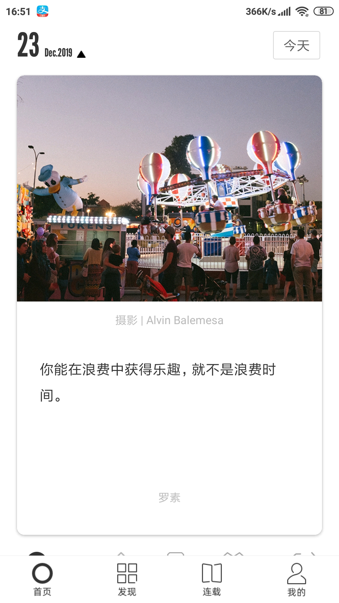
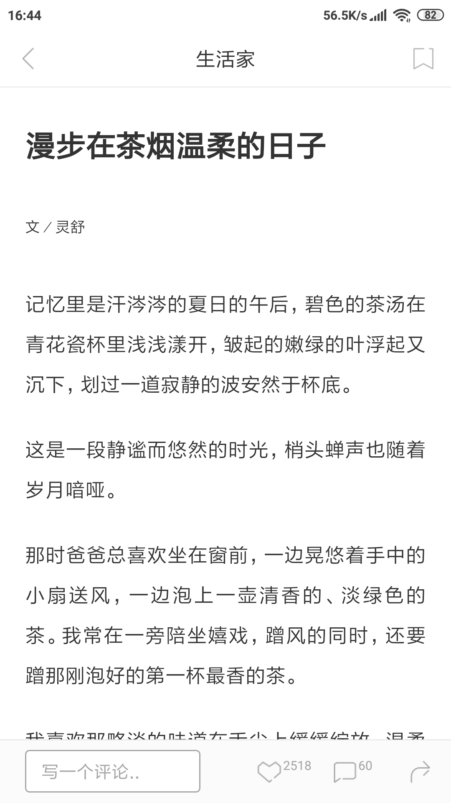

# 中山大学数据科学与计算机学院本科生实验报告
| 课程名称 | 现代操作系统应用开发 |   任课老师   |      郑贵锋      |
| :------: | :------------------: | :----------: | :--------------: |
|   年级   |         2015         | 专业（方向） |     软件工程     |
|   学号   |       15331375       |     姓名     |       叶锐       |
|   电话   |     13332763836      |    Email     | 505441911@qq.com |
| 开始日期 |       2019.12        |   完成日期   |      2020.1      |

## 一、实验题目

期末项目：one·一个——对《one·一个》手机端的仿制

## 二、实现内容

本人负责内容：页面内文本文档以及图片的输入整理

## 三、实验结果

### (1)实验截图

### (2)实验步骤

将《ONE一个》界面中的文本数据及图片录入数据库。

总共分为两个部分，一个是封面推送的文本录入，一个是具体推送的文本录入，如上图所示。

### (3)实验遇到的困难以及解决思路

因为分配到的是较为简单的任务，所以并没有遇到什么困难，唯一的问题就是任务较为繁琐，一共录入了《ONE一个》10多天的推送内容，期间偶尔会录入失误，校验也是一个小麻烦。

## 四、实验思考及感想

实验感想的话，很高兴看到我们组的实验成品，同时也发现软件开发真不是一件简单的事，尽管有了《one一个》的模板参照，需要做的只是依葫芦画瓢，不需要考虑其他大部分的内容，但尽管如此也实属不易。这让我体会到一个软件的诞生是需要经历一个复杂的过程，功能实现，团队沟通，都不可或缺。最后感谢老师和TA这一学期以来的付出，让我学会了很多IOS的相关知识。