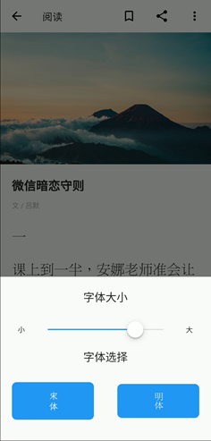
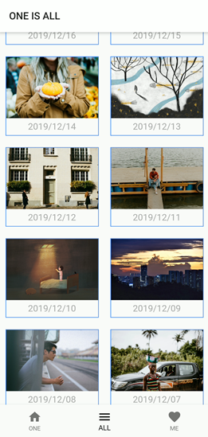

# 中山大学数据科学与计算机学院本科生实验报告

| 课程名称 | 现代操作系统应用开发 |   任课老师   |       郑贵锋       |
| :------: | :------------------: | :----------: | :----------------: |
|   年级   |         15级         | 专业（方向） | 软件工程（嵌入式） |
|   学号   |       15331378       |     姓名     |        尹豪        |
|   电话   |     13307461421      |    Email     | 1103912716@qq.com  |
| 开始日期 |      2019.12.23      |   完成日期   |     2019.12.29     |


## 一、实验题目

对《ONE·一个》手机端的仿制


## 二、实现内容

APP的主要功能在小组报告中有体现，整个APP由`flutter`实现，我负责的部分主要有以下几个：

- 后端：框架的搭建以及API的完成
- APP主页面部分功能：天气刷新功能、收藏按钮
- 文章阅读页面
- 目录页面
- 收藏页面

截图分别如下


## 三、实验结果

整体效果详见APP使用的视频，以下对上述几个页面的结构及关键代码进行说明。

### (1)实验步骤以及关键代码

#### 1.后端及API

环境：

- MySQL v5.7
- node.js v11.0

后端架构采用`MySQL + node.js`，文章等数据存储于数据库中，由`node.js`实现`restful`风格的API。其中，数据库操作由` Sequelize `库实现。数据库的设计以及API文档另外给出。后端部署于宿舍电脑的虚拟机上。


此外，数据库中的内容（文章、照片等），由叶敏和叶锐两位同学手动录入，感谢他们的劳动。

#### 2.主页面的天气部件&分享功能

天气部件在主页面的右上角，会显示当前城市的天气状态及气温。

天气用到一个免费的API：和风天气 [www.heweather.com](http://www.heweather.com/)，这个API为个人开发者免费提供每日一千次的天气信息查询。我们在这里通过用户的IP判断其城市，然后调用api，再根据返回的结果更新`widget`。

天气部件是一个需要用到网络资源的`widget`，这就要求我们异步地更新UI，否则会造成UI无响应，严重影响用户的体验。我使用了`flutter`提供的`FutureWidget`，下面简单介绍一下`FutureWidget`的用法。

**FutureWidget**

简单说，这个控件可以自动地根据设置的异步函数的执行情况，来自动地更新UI的显示。

下面的`_weather`方法调用api接口返回天气情况。

```dart
FutureBuilder(
    future: _weather,//此处为一个异步函数
    builder: (context, snapshot){//snapshot代表上面的异步函数的执行状态
        switch (snapshot.connectionState) {//通过snapshot的不同状态，来返回不同的widget
            case ConnectionState.none:
            case ConnectionState.active:
            case ConnectionState.waiting:
                return Center(child: Text('加载中…',style: TextStyle(fontSize: 12,color: Colors.grey),));
            case ConnectionState.done:
                if (snapshot.hasError) {//当snapshot出错时，可以这样提供对应的widget
                    return Center(
                        child: Text('网络请求出错',style: TextStyle(fontSize: 12,color: Colors.grey),),
                    );
                }
                return Text(snapshot.data,style: TextStyle(fontSize: 12,color: Colors.grey),);
            default:
                return null;
        }
    },
)
```

**分享功能**

这个功能通过直接调用分享接口实现，比较简单，就不详细解释了。

```dart
ShareExtend.share(url, "text");
```

#### 3.文章阅读页面

`reading_page.dart`

| 字体设置                      | 显示文章内容 |
| ----------------------------- | ----------------------------- |
|  |        |

这个页面是文章阅读的主页面，比较复杂，主要功能有以下几点：

- 通过设定的字体显示文章的内容

- 修改字体，并实时地更新ui

- 文章收藏功能：将文章收藏于本地

这个页面主体部分是一个`CustomScrollView`，用于在滑动时隐藏顶栏，而文章内容则使用`SliverList`控件，其第一个成员是一个`Image`部件，用于显示头图，而下面分别是文章的标题、作者及文章内容。

  其中，顶栏放置了几个按钮，实现本页面对应的功能。

  **修改字体**

  字体修改菜单使用`showModalBottomSheet()`构造，其功能是调用这个方法会在底部弹出一个`widget`，其内容则是由自己自定义实现。

  ```dart
  void _showMenuSheet() {
      showModalBottomSheet(
          isScrollControlled: true,
          context: context,
          builder: (builder) {
            //return a widget 
          });
    }
  ```

  而在这个菜单中使用了`CupertinoSlider`来滑动调整字体大小，并且监听到控件的值改变时，就以新的字体大小重绘文章显示的ui。变化结束，则将设置保存于本地，使用的方式是`SharedPerferences`。

  ```dart
  CupertinoSlider(
      value: _fontsize,
      min: 12,
      max: 32,
      //divisions: 100,
      onChanged: (double newvalue){
          _fontsize = newvalue;
          setState(() {});
          state((){});
      },
      onChangeEnd: (double newvalue){
          saveConfigs(articleFontSize: newvalue);
      },
  ),
  ```

  保存字体

  ```dart
  //将字体设置储存于本地
  saveConfigs({String articleFontFamily, double articleFontSize}) async {
      SharedPreferences prefs = await SharedPreferences.getInstance();
      if(articleFontFamily != null)
          prefs.setString('fontFamily', articleFontFamily);
      if(articleFontSize != null)
          prefs.setDouble('fontSize', articleFontSize);
  }
  ```

  **按设置的字体显示内容**

  之所以先讲设置字体，是因为这样更容易解释打开文章时字体如何显示出来。

  ```dart
  //获取本地设置
  getLocal({key}) async {
      prefs = await SharedPreferences.getInstance();
      var result = await prefs.get(key);
      return result;
  }
  //按设置更新ui
  resetUIbySettings() async {
      var ff = await getLocal(key:'fontFamily');
      var fs = await getLocal(key:'fontSize');
      if(ff != null){
          _fontFamily = ff;
      }
      if(fs != null){
          _fontsize = fs;
      }
      setState(() {});//通过以上两个变量更新ui的显示
  }
  ```

  因为设置存在本地，如果等读完本地的设置再显示ui，会严重影响app的流畅度，因此我们不能在ui线程做这种费时操作。

  最合适的方法应该是使用`Future Widget`，通过对异步函数不同状态的判断，返回对应的结果。但由于这里的状态变化比较简单，所以也可以设定两个变量的默认值，并在ui加载时异步地调用`resetUIbySettings()`，这样就可以在读完设置后，直接更新ui。用户很难察觉这个过程，体验很流畅。

#### 目录页面

`vol_list_page.dart`

这个页面采用`GridView`实现，内容比较简单，向后端请求一个`list`，根据其内容显示页面。



#### 收藏页面

`favorite_page.dart`

页面采用`ListView + Dismissible`控件实现，并由`Dismissible`实现了侧滑删除。

收藏列表同样使用`SharedPerferences`存在本地。

```dart
//收藏文章到本地or取消收藏
void _setFavoriteArticle({idVol}) async {
    bool flag;
    if(_iconIndex == 0){
        _iconIndex = 1;
        flag = true;
    }else{
        _iconIndex = 0;
        flag = false;
    }
    setState(() {});
    List favorList = await prefs.get('favorList');
    List<String> tempList = new List();
    if(favorList!=null) tempList = List<String>.from(favorList);
    if(flag){//点击时是未收藏状态
        tempList.add(idVol.toString());
    }else{
        tempList.remove(idVol.toString());
    }
    prefs.setStringList('favorList', tempList);
}
//判断是否收藏过
Future<bool> _isFavor({int idVol}) async {
    List favorList = await getLocal(key: 'favorList');
    for (var items in favorList) {
        if(items == idVol.toString())return true;
    }
    return false;
}
//更新右上角收藏图标
resetFavorIcon() async {
    try{
        if(await _isFavor(idVol:content.id)){
            _iconIndex = 1;
        }
    }finally{
        setState(() {});
    }
}
}
```


而侧滑删除则使用`dismissable`实现，同样ui删除后需要异步地删除本地存储的收藏列表对应内容。

```dart
  favorListDelAt(index) async {
    SharedPreferences prefs = await SharedPreferences.getInstance();
    prefs.setStringList('favorList', _listDataID);
  }
```


## 四、实验思考及感想

一个与网络相关的app，不可避免地会使用到大量的网络资源，在使用这些资源的时候，如何处理ui刷新与资源获取之间的异步关系是很重要的。`flutter`提供的`FutureWidget`是非常有用的widget，它能帮助我们简化异步更新ui的繁琐过程。而完整地以小组的形式开发一个app，不仅对代码能力有一定要求，而且对`git`的使用，以及团队中的分工协作能力都是挑战。这学期的iOS课程对这些能力有了一次不错的锻炼，相信在日后的工作中会是很棒的经验。