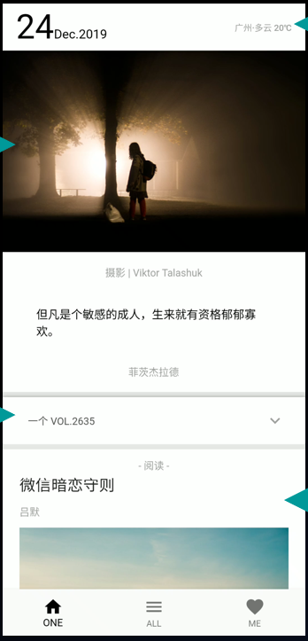
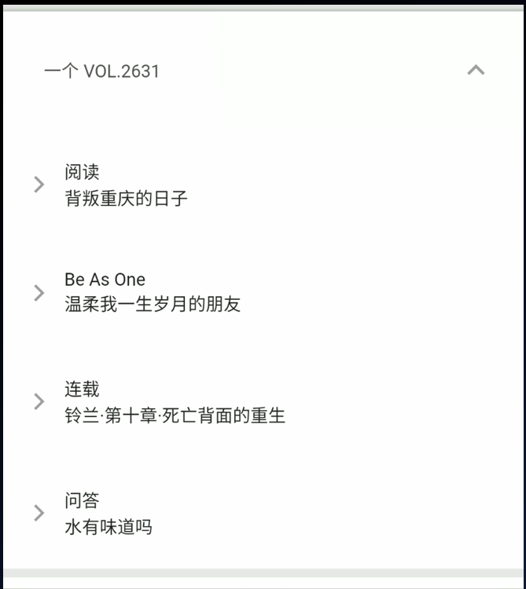

# 中山大学数据科学与计算机学院本科生实验报告
## （2019年秋季学期）
| 课程名称 | 手机平台应用开发 | 任课老师 | 郑贵锋 |
| :------------: | :-------------: | :------------: | :-------------: |
| 年级 | 2019级 | 专业（方向） | 软件工程 |
| 学号 | 17343025 | 姓名 | 冯浚轩 |
| 电话 | 18926301277 | Email | yjfengjunxuan@126.com |
| 开始日期 | 2019.12 | 完成日期 | 2020.01

---

## 一、实验题目
## 期末项目：ONE·一个——对《ONE·一个》手机端的仿制

---

## 二、实现内容
### 本人负责的应用的实现部分：
1. 完成主界面UI的大部分功能
2. 帮助设计方案和其它功能的一些实现

---

## 三、实验结果
### (1)实验截图

截图取自ppt，因为是仿制这部分不重要，能大概看出结构就行

 
  
### (2)实验步骤以及关键代码

整个主界面分为顶部栏和主体列表，顶部栏标识了日期和天气，主体列表则分为三大段：头图部分、伸缩列表部分和文章列表部分

这里的所有内容都需要通过网络请求获取，请求得到的结构保存在类的私有成员中，UI元素依赖于私有成员的数据，网络请求或UI交互会对私有成员产生影响，再使用`setState`函数通知UI产生变化，这里还要处理一下初始空值和请求失败等异常值

---

进入主界面时，首先会请求当天的vol

```dart
  int _todayVol;

  Future<void> _requestTodayVol() async {
    try {
      var response =
          await Dio().get("http://ftp.yuask.cn:54321/api/today_list");
      _todayVol = response.data["vol"];
      setState(() {});
    } on Exception {}
  }
```

后续部分会使用该数值确定是否是当天的内容，在UI上会有一些不同的元素。该数值初始时为空，请求成功后才会非空，可以按照是否为空显示正常内容或是错误内容，为了实现左右滑动效果，主体部分使用PageView实现，对于每一个vol对应的页面使用Page类来封装

---

对于每个Page类的Stateful实现，维护下面的一些数据，分别表示列表内容以及列表内容是否被正确加载、伸缩列表是否被加载以及天气数据

```dart
  bool _isExpanded = false;
  ReqContent _content;
  bool _isLoadSuccess = false;
  Future<String> _weather;//获取天气
  String weatherData;
```

Page包括顶部的日期和天气，这一部分使用一个Row控件进行排列即可，主体部分使用ListView控件排列，分为头图部分、伸缩列表部分和文章列表部分

头图部分使用Column控件依次排列图像、作者、文本等内容，基本整个主页面都是直接按顺序把UI元素用代码排列进去就是了，外加一点逻辑的处理。下面给出头图部分的代码作为例子：

```dart
// 头图部分
if (index == 0) {
  return Column(
    children: <Widget>[
      GestureDetector(
        child: FadeInImage(
          height: 240,
          placeholder: MemoryImage(kTransparentImage),
            image: NetworkImageWithRetry(_content.photoUrl)),
        onTap: () {
          _jumpToBigPhoto(_content.photoUrl);
        },
      ),
      Center(
        child: Padding(
          child: Text(
            "摄影 | " + _content.photoAuthor,
            style: TextStyle(color: Colors.grey),
          ),
          padding: EdgeInsets.all(15),
        ),
      ),
      Center(
        child: Padding(
          child: Text(
            _content.motto,
            style: TextStyle(color: Colors.black, fontSize: 16),
          ),
          padding: EdgeInsets.only(
              left: 40, right: 40, top: 15, bottom: 15),
        ),
      ),
      Center(
        child: Padding(
          child: Text(
            _content.mottoAuthor,
            style: TextStyle(color: Colors.grey),
          ),
          padding: EdgeInsets.only(
              left: 40, right: 40, top: 15, bottom: 15),
        ),
      ),
    ],
  );
}
```

其它部分也是差不多的结构，代码也很繁杂，就不贴上来了。总之，将顶部栏于主体的ListView定义好后，在外层使用Scaffold将其整合，这就是一个Page类的UI定义

```dart
return Scaffold(
  backgroundColor: Colors.white,
  appBar: AppBar(
    automaticallyImplyLeading: false,
    title: titleWidget,
  ),
  body: RefreshIndicator(
    child: bodyWidget,
    onRefresh: () async {
      requestOneArticle(widget._vol);
    },
  ),
);
```

在Page类被构造时，还要自定义构造函数传入下面的数据。`_vol`表示该Page要展示的vol，而对于非最新的vol，天气部分会被替换为“返回今日”的按钮，这通过`_isToday`来判断，并传入`_jumpToToday`函数回调，让点击按钮时能调用上层的PageView进行页面切换。在这里我将是否为首页的判断交给PageView，这样里面的每个Page就只需要关注于显示对应的vol，让逻辑更加清晰。

```dart
  final bool _isToday;
  final int _vol;
  final Function() _jumpToToday;
  Page(this._isToday, this._vol, this._jumpToToday);
```

### (3)实验遇到的困难以及解决思路

很大一部分的困难在于flutter是一个比较新的平台，资料不太完善，也会在某些地方被坑，例如自带的Image.network在请求失败时会导致直接崩溃，不过还好也还有些第三方的库可以使用，算是可以解决。另外就是对整个的开发平台和语言方面，flutter写UI方面我觉得是挺顺手的，但是把处理逻辑也放进来的话，内容多了就会显得挺混乱的，特别是还要跟别人交流，不管怎么说，进行充分的交流和讨论都是必要的，整个项目的主题、框架等前期内容更是需要详细的讨论交流才能确定。
  
## 五、实验思考及感想

这个实验是一个比较综合性的项目，这里我们是对已有的APP进行仿制，在实际实现过程中会发现山寨也不是一件容易的事，尽管能够做出一个一眼看上去很像的东西，但细节方面还是会有很大差别，例如原版APP的顶栏是不会随着左右滑移动的，但在我们实现的过程中就发现要按照我们的逻辑去处理日期的变更是很困难的，最后就只能让它随着主体一起滑动。给定那么一段时间，我们就要考虑完成度到多少才合适，进而影响后续的设计，广泛店来讲就是需求分析和实现的过程，这还只是去进行山寨，可想而知原创应用会更加复杂。这样的一次经历也算是让我对现实中的软件开发有了一点实际的感受吧。