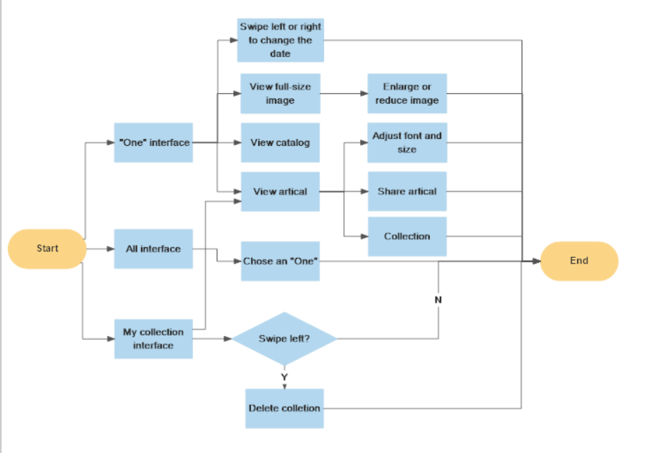

# 19小组实验报告

**项目名称**：《ONE·一个》APP的仿制

**后端环境：**

- MySQL v5.7
- node.js v11.0

后端架构采用`MySQL + node.js`，文章等数据存储于数据库中，由`node.js`实现`restful`风格的API。其中，数据库操作由` Sequelize `库实现。数据库的设计以及API文档另外给出。

**前端：**

由`flutter`实现，具体由五个页面构成如下：

```
big_photo.dart//大图浏览
favorite_page.dart//收藏页面
main_screen.dart//主页面
reading_page.dart//阅读页面
vol_list_page.dart//目录页面
```

**分工：**

| 学号     | 姓名         | 主要工作                                                     |
| -------- | ------------ | ------------------------------------------------------------ |
| 15331378 | 尹豪（组长） | 后端：框架的搭建以及API的完成<br>主页面个别功能：天气显示功能、收藏按钮<br>收藏页面、阅读页面、目录页面 |
| 17333025 | 冯浚轩       | 完成主页面大部分内容（包括大图浏览页面）                     |
| 15331374 | 叶敏         | 数据采集，软件流程图                                         |
| 15331375 | 叶锐         | 页面文档图片录入                                             |

## 后端

数据库设计见 [数据库设计](./datebaseDesign.md)

### RESTful API

| 序号 | URL                | HTTP方法 | 发送内容 | 返回结果         |
| ---- | ------------------ | -------- | -------- | ---------------- |
| 1    | /api/today_list    | GET      | 空       | 最新的文章列表   |
| 2    | /api/list/:vol     | GET      | 空       | 第vol期文章列表  |
| 3    | /api/ article /:id | GET      | 空       | 特定id的文章内容 |

### 1. GET /api/today_list

获取今日的文章列表

不发送内容

返回格式如下，各数据意义详见数据库设计。

```json
{
    "vol": 2634,
    "year": 2019,
    "month": 12,
    "day": 23,
    "motto": "你说是 辣就是",
    "motto_auth": "天皇",
    "photo_url": "http://image.wufazhuce.com/FnW4HPyoiKOofjviWyBbdKsD3ITs",
    "photo_auth": "Alvin Balemesa",
    "articles_count": 3,
    "articles_list": [
        {
            "ID_vol": 263401,
            "content_type": "阅读",
            "title": "摔了一跤111",
            "auth": "王大乂",
            "photo_url": "http://image.wufazhuce.com/FnW4HPyoiKOofjviWyBbdKsD3ITs",
            "foreword": "111斗气别隔夜，把话说明白，依然是互相帮助的伙伴。"
        },
        {
            "ID_vol": 263402,
            "content_type": "生活家",
            "title": "摔了一跤222",
            "auth": "王大乂",
            "photo_url": "http://image.wufazhuce.com/FnW4HPyoiKOofjviWyBbdKsD3ITs",
            "foreword": "222斗气别隔夜，把话说明白，依然是互相帮助的伙伴。"
        },
        {
            "ID_vol": 263403,
            "content_type": "搞黄色",
            "title": "摔了一跤333",
            "auth": "王大乂3",
            "photo_url": "http://image.wufazhuce.com/FnW4HPyoiKOofjviWyBbdKsD3ITs",
            "foreword": "333斗气别隔夜，把话说明白，依然是互相帮助的伙伴。"
        }
    ]
}
```

### 2. GET /api/list/:vol

获取特定期的目录内容。

不发送内容

返回格式与1.获取当日目录相同，各数据意义详见数据库设计。


### 3.GET /api/ article /:id

获取特定id的文章内容，其中id前四位为vol，后两位为文章编号。

不发送内容

返回格式如下，各数据意义详见数据库设计。

```json
{
    "ID_vol": 263401,
    "content_type": "阅读",
    "title": "摔了一跤111",
    "auth": "王大乂",
    "photo_url": "http://image.wufazhuce.com/FnW4HPyoiKOofjviWyBbdKsD3ITs",
    "foreword": "111斗气别隔夜，把话说明白，依然是互相帮助的伙伴。",
    "content": "01 \n\n王丽丽那天再次走上地铁褡裢坡B口的扶手电梯时，忽然明白自己两周前为什么会在上面摔了一跤。\n\n她那一跤摔得不算尴尬，因为当她爬起来等到电梯运行至路面，颠簸着走到旁边弯起腰缓解疼痛时，才有人从她身旁路过。……"
}
```

后端部署方法：

1. 使用MySQL 5.7 + node.js 10.0
2. 在`MySQL`中使用`/code/Group19/ONE_backend/一些设计思路/SQLinit.sql`建表
3. `node app.js`启动服务

## 客户端

客户端提供的内容类似于一个公众号，每天对应一个主页面，其中有一张图片、一句格言和几篇文章。客户端的具体功能可见本目录下的视频演示及ppt，对应的实现详见各功能实现人员的个人实验报告。

